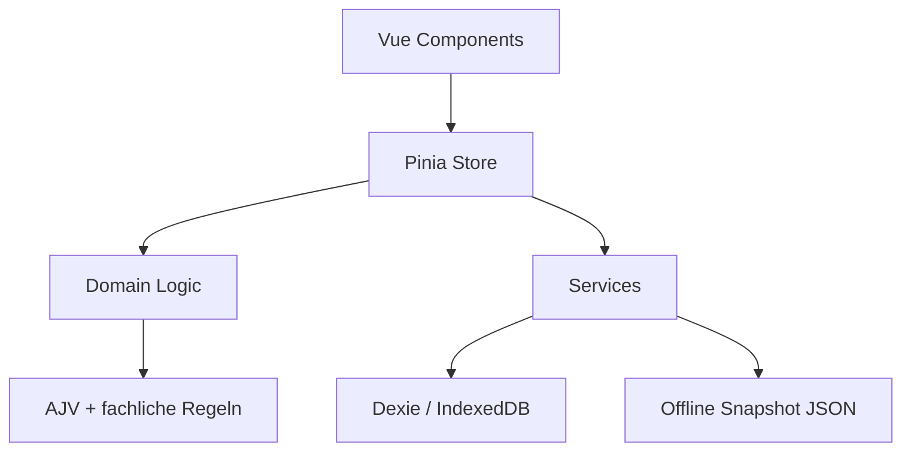

# Architektur

Diese Datei beschreibt die technische Architektur der Anwendung aus Sicht von Entwicklern.

## Zielbild

Die Anwendung ist eine lokale SPA fuer die Bearbeitung von Metadaten eines einzelnen `Dataset`. Der Fokus liegt auf:

- klaren Ladepfaden
- vollstaendigem Offline-Betrieb
- robuster lokaler Persistenz
- einfacher Erweiterbarkeit
- klarer Trennung zwischen Domain, Persistenz und UI

## Architekturprinzipien

- Kein Backend im MVP
- Root-JSON als kanonisches Speicher- und Exportformat
- Toleranter Import, strenger Export
- Lokale Persistenz als Default, nicht als Sonderfall
- UI-Zustaende werden zentral ueber den Store koordiniert
- Validierung ist von Komponenten getrennt
- Quellen sind konfigurierbar und im MVP als Offline-Snapshots umgesetzt

## Schichtenmodell



## Zentrale Module

### `src/app`

- `App.vue`
  - App-Shell
  - Header
  - Hauptnavigation
  - Kontextzeile
  - globaler Export-Button
- `router.ts`
  - definiert die vier Routen des MVP

### `src/domain`

- `datasetTypes.ts`
  - zentrale Typen fuer JSON, Drafts, Quellen und Validierung
- `normalize.ts`
  - erzeugt das leere Default-Root
  - erkennt Serienmuster
  - normalisiert Root-Import und Naked-Import
  - fuellt fehlende Strukturen mit Default-Werten auf
- `validation.ts`
  - Strukturvalidierung mit AJV
  - fachliche Validierung auf Feldebene

### `src/services`

- `datasetRepository.ts`
  - kapselt Dexie
  - listet, speichert, loescht und dupliziert Drafts
  - verwaltet Settings
- `endpointLoader.ts`
  - laedt Suchindizes und Dataset-Details aus Snapshot-Dateien
  - fuehrt Filterung und Direktladen aus
- `fileImporter.ts`
  - liest lokale Dateien
  - parse + Strukturpruefung + Normalisierung
- `exportService.ts`
  - Root-JSON serialisieren
  - Download ausloesen

### `src/stores`

- `datasetStore.ts`
  - zentrale App-State-Maschine des MVP
  - verwaltet Draft-Liste, aktuellen Entwurf, Save-State und Konfliktfall

### `src/components`

- `StartPage.vue`
  - Einstieg in die drei Ladewege
- `SourceLoadDialog.vue`
  - Snapshot-Quelle waehlen, suchen, Vorschau, uebernehmen
- `FileImportDialog.vue`
  - Dateiimport mit Fehlerbehandlung und Vorschau
- `DatasetEditor.vue`
  - Editor-Wrapper fuer Datensatz, Attribute und JSON-Vorschau
- `DatasetForm.vue`
  - Hauptformular
- `AttributeTable.vue`
  - tabellarische Bearbeitung der Attribute
- `ValidationPanel.vue`
  - rechte Pruefspalte

## Routing

Die Anwendung verwendet drei Editor-Routen plus Startseite:

```text
/                      Startseite
/draft/:id             Datensatz
/draft/:id/attributes  Attribute
/draft/:id/json        JSON-Vorschau
```

Die Routen sind bewusst flach gehalten. Der aktuelle Draft wird ueber die `id` im URL-Pfad geladen.

## Datenfluss

### 1. App-Start

1. `App.vue` mounted.
2. `datasetStore.initialize()` wird ausgefuehrt.
3. Draft-Liste wird aus IndexedDB gelesen.
4. letzte Quellenfilter werden aus `settings` geladen.

### 2. Dateiimport

1. Benutzer waehlt eine lokale Datei.
2. `fileImporter.ts` liest den Inhalt.
3. `validation.ts` validiert die Struktur.
4. `normalize.ts` ueberfuehrt das Ergebnis in `DatasetRootJson`.
5. `datasetStore.stageImport()` prueft Identifier-Konflikte.
6. Der Draft wird in IndexedDB gespeichert und geoeffnet.

### 3. Quellen-Import

1. Benutzer waehlt eine Quelle.
2. `endpointLoader.ts` laedt `index.json`.
3. Suche/Filter laufen im Browser.
4. Bei Direktladen oder Trefferwahl wird die passende Dataset-Datei geladen.
5. Strukturvalidierung und Normalisierung laufen wie beim Dateiimport.
6. Der Draft wird gespeichert und geoeffnet.

### 4. Bearbeitung und Autosave

1. Formularfelder mutieren direkt `currentDraft.data`.
2. `DatasetEditor.vue` beobachtet `store.currentDraft.data`.
3. `store.markDirty()` setzt den Status auf `dirty`.
4. Nach `750 ms` ohne weitere Aenderung wird `persistCurrentDraft()` ausgefuehrt.
5. Der Draft wird mit neuem `updatedAt` in IndexedDB geschrieben.

### 5. Export

1. `App.vue` berechnet laufend `validateDataset(...)`.
2. Bei Fehlern bleibt der Export deaktiviert.
3. Bei Erfolg wird das Root-JSON serialisiert und heruntergeladen.

## Root-Format und Importtoleranz

Interner und exportierter Zielzustand:

```json
{
  "type": "Dataset",
  "schemaVersion": "2026-05-23",
  "dataset": {}
}
```

Beim Import sind zwei Formen erlaubt:

- Root-Wrapper
- nacktes Dataset-Objekt

Wichtig:

- Unbekannte Felder werden beibehalten.
- Beim Export wird immer der Root-Wrapper verwendet.

## DatasetSeries-Erkennung

Serien werden in `normalize.ts` und `validation.ts` frueh erkannt. Typische Marker:

- `type === "DatasetSeries"`
- `series`
- `issues`
- `issueLabel`
- `isCurrentIssue`

Die App lehnt solche JSON-Dateien mit einer fachlich formulierten Fehlermeldung ab.

## Validierungsarchitektur

### Strukturvalidierung

AJV prueft:

- Root muss Objekt sein
- bei Root-Wrapper: `type === "Dataset"` und `dataset` vorhanden
- `additionalProperties: true`

### Fachliche Validierung

Die fachliche Validierung prueft:

- Pflichtfelder
- Beschreibung max. 1024 Zeichen
- keine fuehrenden/nachgestellten Leerzeichen im Identifier
- E-Mail-Format
- URL-Format
- ISO-Daten `YYYY-MM-DD`
- `modified >= issued`
- `temporalCoverage` als XOR-Regel
- keine doppelten Attributnamen
- Warnung bei Attributen ohne Beschreibung

Das Ergebnis ist eine Liste von `ValidationIssue` mit:

- `severity`
- `code`
- `path`
- `message`

## Persistenzmodell

### IndexedDB

Verwendete Datenbank:

```text
datenblatt-editor
```

Stores:

```text
datasets
settings
```

### Store `datasets`

Wichtige Felder:

- `id`
- `identifier`
- `title`
- `updatedAt`
- `sourceType`
- `sourceLabel`
- `sourceUrl`
- `originalFileName`
- `schemaVersion`
- `data`
- `dirty`

### Store `settings`

Wichtige Eintraege:

- `lastSourceId`
- `lastOrganizationUnit`

## Konfliktbehandlung

Beim Import oder Quellenladen wird vor der Speicherung nach einem existierenden Draft mit demselben fachlichen `identifier` gesucht.

Moegliche Benutzerentscheidungen:

- lokalen Entwurf oeffnen
- Import als neue Kopie speichern
- lokalen Entwurf ueberschreiben

Der interne Primarschluessel bleibt immer eine UUID und ist bewusst vom fachlichen `identifier` getrennt.

## PWA und Offline

### Build-Konfiguration

`vite.config.ts` bindet `vite-plugin-pwa` ein. Die Workbox-Konfiguration cached:

- HTML
- JS
- CSS
- SVG
- JSON
- PNG
- WOFF2

Damit sind auch die Snapshot-Dateien in `public/mock-sources/**` Teil des Precaches.

### Konsequenz

Die Anwendung ist nach erfolgreichem Laden installierbar und auch offline lauffaehig.

Grenzen:

- Snapshot-Inhalte werden nicht online synchronisiert.
- Ein Browser kann lokale Entwuerfe eines anderen Browsers nicht sehen.

## UI-System

Die Styles sind in vier Ebenen getrennt:

- `tokens.css`
- `base.css`
- `components.css`
- `utilities.css`

Die Grundidee:

- semantische Tokens fuer Farben und Borders
- neutrale, helle Flaechen
- kleine Radien
- rote Primaeraktionen
- klare Werkzeugs- und Formdensitaet

## Testarchitektur

### Unit-Tests

- Normalisierung
- Struktur-/Fachvalidierung
- Export
- Dateiimport
- Suchlogik

### Komponenten-Test

- `ValidationPanel`

### E2E

- Offline-Quellenfluss vom Suchdialog bis zur Editor-Uebernahme

## Erweiterungspunkte

### Echte Remote-Endpunkte

Heute:

- `searchIndexPath`
- `datasetPathTemplate`

Spaeter moeglich:

- HTTP-Suche
- Authentifizierung
- Timeout-/Retry-Strategien

### Weitere Felder

Neue Felder muessen in mehreren Schichten nachgezogen werden:

1. Typ in `datasetTypes.ts`
2. Default in `createEmptyDatasetRoot()`
3. ggf. Hydration in `normalize.ts`
4. fachliche Regel in `validation.ts`
5. UI in `DatasetForm.vue` oder `AttributeTable.vue`

### Staerkere Routing-Segmentierung

Der Editor koennte spaeter weiter aufgeteilt werden, etwa:

- eigener Route-Abschnitt pro Formsegment
- Deep-Linking zu Validierungsfehlern
- Wizard fuer Nicht-MVP-Faelle

## Bekannte Architekturgrenzen

- Kein globaler Undo/Redo-Mechanismus
- Kein Versionsvergleich zwischen Drafts
- Keine migrationsgestuetzte Schema-Transformation fuer alte Drafts
- Keine serverseitige Validierungsquelle
- Keine testweise simulierbare Live-Quelle neben dem Snapshot-Modell
